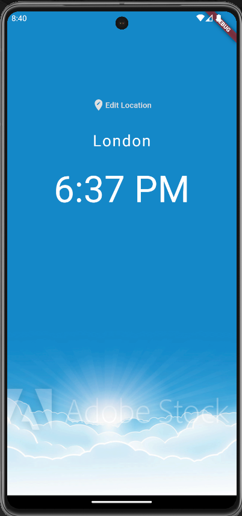
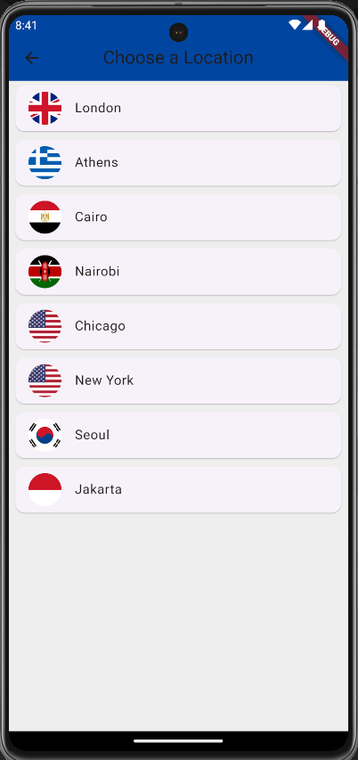
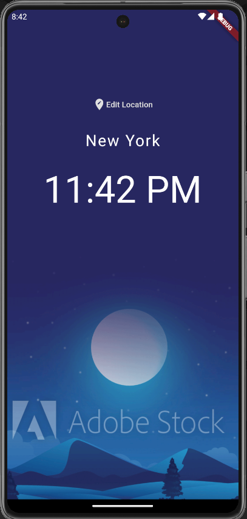

# World Time

This is an app that help you see the hours from other countries. I created this project to help me consolidate my new Flutter skills.

## About this application

In this app you can see the hours from the country that you selected. All data is obtained from the World Time API.

  
  
  

